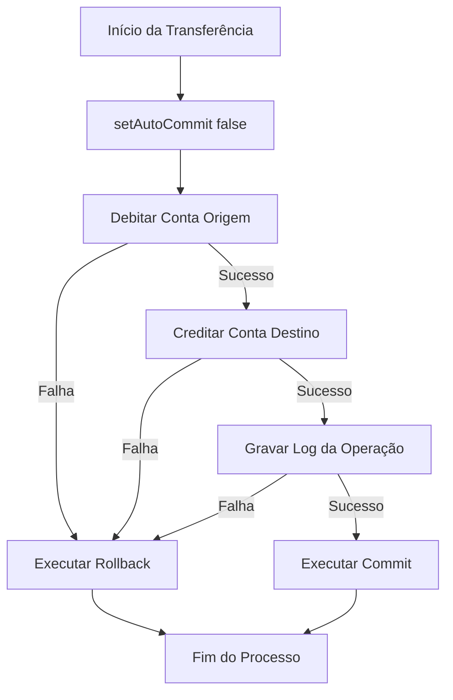

# 🏦 SalesDepartmentAPI BACK-END - Java & JDBC

[](https://oracle.com)
[](https://postgresql.org)
[](https://apache.org)

Este projeto demonstra a implementação de um sistema robusto de transações financeiras utilizando **Java SE** e **JDBC Core**. O objetivo principal é garantir a consistência de dados em operações críticas por meio do controle manual do ciclo de vida das transações.

---

## 🎯 Recursos Computacionais

### 1. Integridade Transacional (ACID)
*   **Controle Manual:** Uso de `setAutoCommit(false)` para agrupar operações interdependentes.
*   **Resiliência:** Execução de `commit()` apenas após o sucesso total de todas as etapas da operação.
*   **Rollback Automático:** Desfazimento imediato de alterações pendentes em caso de qualquer `SQLException`.

### 2. Segurança e Eficiência no JDBC Core
*   **Proteção SQLi:** Uso estrito de `PreparedStatement` para sanitizar entradas e evitar ataques de injeção de SQL.
*   **Resource Management:** Tratamento seguro de fechamento de conexões com blocos `try-with-resources`.

### 3. Rastreabilidade
*   **Histórico:** Registro estruturado de logs de sucesso e falha das operações financeiras diretamente no terminal.

---

## 📐 Arquitetura do Banco de Dados

O banco de dados utiliza regras de integridade diretamente no motor do **PostgreSQL**:

```sql
CREATE TABLE accounts (
    id SERIAL PRIMARY KEY,
    name VARCHAR(100) NOT NULL,
    balance DECIMAL(10, 2) NOT NULL CHECK (balance >= 0)
);

CREATE TABLE transaction_logs (
    id SERIAL PRIMARY KEY,
    source_account INT REFERENCES accounts(id) ON DELETE CASCADE,
    destination_account INT REFERENCES accounts(id) ON DELETE CASCADE,
    amount DECIMAL(10, 2) NOT NULL,
    created_at TIMESTAMP DEFAULT CURRENT_TIMESTAMP
);
```

---

## 💻 Fluxo Lógico da Transação

O diagrama abaixo ilustra o comportamento do sistema durante uma transferência bancária:



---

## 🚀 Como Executar o Projeto

### 1. Clonar o Repositório
```bash
git clone github.com
cd nome-do-repositorio
```

### 2. Configurar o Banco de Dados
Acesse o arquivo de configuração de conexão (ex: `DB.java`) e insira suas credenciais locais do PostgreSQL:
```java
private static final String URL = "jdbc:postgresql://localhost:5432/seu_banco";
private static final String USER = "seu_usuario";
private static final String PASS = "sua_senha";
```

### 3. Compilar e Rodar
Execute a aplicação via terminal utilizando o Maven:
```bash
mvn compile exec:java -Dexec.mainClass="seu.pacote.Main"
```

---

## 🤝 Contribuindo

Ideias para evolução do repositório:
*   Implementação de diferentes níveis de isolamento (`Connection.TRANSACTION_SERIALIZABLE`).
*   Migração do script SQL para versionamento automatizado com **Flyway**.
*   Criação de testes unitários para cenários de concorrência com **JUnit**.

---
Desenvolvido com ☕ por [Lucas Silva](https://github.com)
